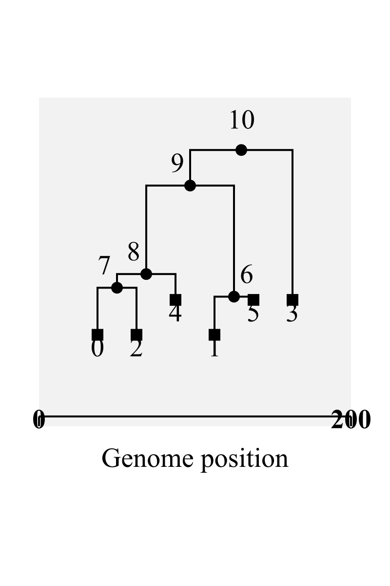

## The basic msprime approach

This is what we're going for, but we're going to ultimately build all the objects programmatically 

```{python}
#| label: msprime-basic
#| output: false

import msprime

# make simple demography
demography = msprime.Demography()
demography.add_population(name = "A", initial_size = 10_000)
demography.add_population(name = "B", initial_size = 5_000)
demography.add_population(name = "C", initial_size = 1_000)
demography.add_population_split(
    time = 1000, 
    derived = ["A", "B"], 
    ancestral = "C"
)

# simulate ancestry with specific sampling times
# the idea is we could make the `SampleSet`s programmatically 
ts = msprime.sim_ancestry(
    samples = [
        msprime.SampleSet(5, population = "A", time = 500), 
        msprime.SampleSet(5, population = "A", time = 0), 
        msprime.SampleSet(5, population = "B", time = 500), 
        msprime.SampleSet(5, population = "B", time = 0), 
    ], 
    demography = demography, 
    ploidy = 1, 
    sequence_length = 200
)

# simulate mutations
mts = msprime.sim_mutations(ts, rate = 0.0001)

```

And this is how we will gather data from the simulation

```{python}
#| label: gen-data-basic

import pandas as pd
import tskit

# node table with all info
ntab = mts.tables.nodes

# pandas dataframe of needed info for sample nodes only
df_ind = pd.DataFrame({
    "ids": ntab.individual, 
    "pops": ntab.population, 
    "time": ntab.time})
df_ind = df_ind[df_ind["ids"] > -1] # NOTE!!! this only works if `ploidy = 1`

# get actual names of the populations 
pop_names = pd.Series([pop.metadata["name"] for pop in mts.tables.populations])
df_ind["name"] = df_ind["pops"].map(pop_names)

# get simulated sequences
df_ind["seq_alignment"] = list(mts.alignments(
    samples = df_ind["ids"].tolist(), 
    reference_sequence = tskit.random_nucleotides(ts.sequence_length)
))

# aggregate df so rows are species and column of ids is a column of lists
df_spp = df_ind.groupby(["time", "pops", "name"])['ids'].apply(list).reset_index()

# get diversities and Tajima for each pop in each time
df_spp["pi"] = mts.diversity(df_spp["ids"].tolist())

```


The other challenge we need to figure out is how to create potentially multiple local populations budding off the same ancestral (metacommunity) lineage.  Here is how:

```{python}
#| label: budding-local
#| output: false

# setup demography with temporally explicit names
demography = msprime.Demography()
demography.add_population(name = "local_ancient", initial_size = 5000)
demography.add_population(name = "meta_ancient", initial_size = 50000)
demography.add_population(name = "anc", initial_size = 50000)

demography.add_population_split(
    time = 80000, 
    derived = ["local_ancient", "meta_ancient"], 
    ancestral = "anc"
)

demography.add_simple_bottleneck(
    time = 80000, 
    population = "local_ancient", 
    proportion = 1
)

demography.add_population(name = "local_recent", initial_size = 5000)
demography.add_population(name = "meta_recent", initial_size = 50000)

demography.add_population_split(
    time = 5000, 
    derived = ["local_recent", "meta_recent"], 
    ancestral = "meta_ancient"
)

demography.add_simple_bottleneck(
    time = 5000, 
    population = "local_recent", 
    proportion = 1
)

demography.sort_events()

ts = msprime.sim_ancestry(
    samples = [
        msprime.SampleSet(1, population = "local_recent", time = 0),
        msprime.SampleSet(2, population = "meta_recent", time = 0),
        msprime.SampleSet(1, population = "local_ancient", time = 20000),
        msprime.SampleSet(2, population = "meta_ancient", time = 20000)
    ], 
    demography = demography, 
    ploidy = 1, 
    sequence_length = 200
)


# visualize coal tree
tree = ts.draw_svg()
with open("tree.svg", "w") as f:
    f.write(tree)

```

```{r}
rsvg::rsvg_png("tree.svg", "tree.png", width = 800, height = 1200)


file.remove(c("tree.svg", "tree.png"))
```

Here is the mapping of IDs to population names
```{python}
#| label: foo

foo = {n.id:ts.population(n.population).metadata["name"] for n in ts.nodes()}
pd.DataFrame(list(foo.items()), columns=['node_id', 'population_name'])
```

To confirm this genealogy is correct we have to check that:

- the ancestor of `local_ancient` samples is `anc`
- the ancestor of `meta_ancient` samples is `anc` or `meta_ancient`
- the ancestor of `local_recent` samples is `meta_ancient`
- the ancestor of `meta_recent` samples is `meta_ancient`

which is all true.

The key insight is that we need to (from the forward time perspective) add oldest populations first and have ancestor of more recent splits be the metacommunity population of the previous split.

Now we can get going for real

## RoLE model set-up

First we make a simple RoLE model simulation

```{r}
#| label: role-setup
#| warning: false

library(roleR)
library(ape)

p <- roleParams(species_meta = 3, dispersal_prob = 0.1,
                alpha = 10000,  mutation_rate = 0.00001, 
                niter = 1000000, niterTimestep = 500000)
m <- roleModel(p)
r <- runRole(m)

finalPhylo <- r@modelSteps[[length(r@modelSteps)]]@phylo

nspp <- finalPhylo@n

tBySpp <- sapply(r@modelSteps, function(d) {
    x <- tabulate(d@localComm@indSpecies)
    n <- length(x)
    x <- c(x, rep(0, nspp - n))
}) |> t()


# create objects that will be accessed by msprime ----

# localAbund (not spp indeces, actual abunds through time), 
# time info added
time_sp <- cbind(r@info[, c("timestep", "generations")], tBySpp) 

# metaAbund
meta_abund <- round(r@modelSteps[[1]]@metaComm@spAbund * 
                        r@info$individuals_meta[1])

# localTDiv, need to make something arbitrary for now
tdiv <- matrix(time_sp$generations - 0.1 * min(diff(time_sp$generations)), 
               nrow = nrow(tBySpp), ncol = ncol(tBySpp))
tdiv[tdiv < 0] <- 0
tdiv[tBySpp == 0] <- NA

for(i in 1:ncol(tdiv)) {
    tdiv[!is.na(tdiv[, i]), i] <- min(tdiv[, i], na.rm = TRUE)
}

colnames(tdiv) <- 1:nspp


# metaTree
nwk <- as(finalPhylo, "phylo") |> write.tree(digits = 18)
```


## msprime set-up

First import needed packages and define one necessary custom function to force trees to be exactly ultrametric 

```{python}
#| label: py-setup

import msprime
import newick
import numpy as np
import pandas as pd
from collections import Counter, defaultdict
import tskit

def _force_ultrametric(tree):
    """
    Force all leaf nodes to time 0
    Input a newick tree in string format
    Output is a modified newick tree with all leaves having equal total length
    """
    # Parse the newick tree string.
    parsed = newick.loads(tree)
    if len(parsed) == 0:
        raise ValueError(f"Not a valid newick tree: '{tree}'")
    root = parsed[0]

    # Set node depths (distances from root).
    stack = [(root, 0)]
    max_depth = 0
    while len(stack) > 0:
        node, depth = stack.pop()
        if depth > max_depth:
            max_depth = depth
        node.depth = depth
        for child in node.descendants:
            stack.append((child, depth + child.length))
    for node in root.walk():
        if node.is_leaf:
            ## Add offset to node.length to foce all nodes to fall at time 0
            ## The offset is the difference between the depth of this node
            ## and the max_depth of the deepest leaf node.
            node.length = node.length + (max_depth - node.depth)
    return root.newick

```


Gather objects made in R:

- a data.frame of time steps (including generations)
- a data.frame with taxa as columns and rows as time steps showing abundance per time step
- a data.frame of abundances in the metacommunity
- a data.frame of divergence times
- a phylogenetic tree
- param `alpha`
- param `m`
- the current time (from forward perspective)
- J, the local community size


```{python}
#| label: py-read

# read in things from R
time_sp = r.time_sp
meta_abund = r.meta_abund
tdiv = r.tdiv
nwk = r.nwk
phylo_meta = _force_ultrametric(nwk)


# set alpha and m here, but in final implementation, weʻll pass it in
alpha = r.slot(r.p, "alpha")(1)
m = r.slot(r.p, "dispersal_prob")(1)

# calculating curtime, we could pass it in, or calculate
curtime = time_sp["generations"].max()

# could just pass J, also need to think about fluctuating J
J = time_sp.drop(["timestep", "generations"], axis = 1).iloc[0].sum() 

# size of metacomm, could pass in
Jm = sum(meta_abund) 
```

Now reformat those objects into what we need for *msprime*

```{python}
#| label: py-convert

# convert R inputs to python objects we need

local_sad = time_sp.drop(["timestep", "generations"], axis = 1)

meta_Nes = {x+1:y*alpha for x,y in enumerate(meta_abund)}

# create a default dict so internal nodes have a default Ne
dNe = round(Jm / len(meta_Nes) * alpha)
meta_Nes = defaultdict(lambda: dNe, meta_Nes)

# proportional metacomm abundances
meta_p = {f"{x+1}":(y / Jm) for x,y in enumerate(meta_abund)}


local_sad_ts = local_sad.to_dict("records")

# objects relating to harmonic mean
local_hm_ts = local_sad_ts # for now making harmonic mean = abundance
local_p_ts = (local_sad / J).to_dict("records") # "p" is harm mean of rel abund


gens = time_sp["generations"].to_list()


# NOTE: tdiv and other time objects **must** be sorted from ancient to current
tdiv = pd.DataFrame(tdiv, columns = local_sad.columns)
local_tdiv_ts = tdiv.to_dict("records")
```


## Construct the demography model

A special note on migration rate: the [msprime definitions section](https://tskit.dev/msprime/docs/stable/demography.html#definitions) gives the following definition for migration rate

> Continuous migration between populations is modeled by a $d \times d$ matrix $M$ of per-generation migration rates. The $(j, k)^{th}$ entry of $M$ is the expected number of migrants moving [*in forward time*] from population $k$ to population $j$ per generation, divided by the size of population $j$. In terms of the coalescent process, $M_{j, k}$ gives the rate at which an ancestral lineage moves [*backward in time*] from population $k$ to population $j$, as one follows it back through time.


Let's break this down for our model.  First, the metacommunity population is $k$, the local population is $j$, so we are after $M_{local, meta}$.

Expected number of migrants per *time step* for species $i$ is $m p^{(i)}_{meta}$ where $m$ is overall migration probability and $p^{(i)}_{meta}$ is the *relative* abundance of species $k$ in the metacommunity. To get migrants per generation we multiple by number of time steps per generation ($J/2$): $m p^{(i)}_{meta} J/2$. The size of the local population fluctuates, so let's assume we'll use the harmonic mean abundance $h^{(i)}_{local}$. We also need to account for the scaling factor $\alpha$ which scales sampled abundance to population size, so population size is $\alpha h^{(i)}_{local}$. Putting it all together:

$$
M_{local, meta}^{(i)} = \frac{m p^{(i)}_{meta} J}{2 \alpha h^{(i)}_{local}}
$$

We might want to allow $J$ to vary. For that to happen, the easiest way would be to define $\eta^{(i)}_{local} = H(N^{(i)}_{local} / J)$ which is the harmonic mean of the local *proportional* abundance of species $i$ and is something we can keep track of forward in time.  Then we say

\begin{align}
M_{local, meta}^{(i)} &= \frac{m p^{(i)}_{meta} J}{2 \alpha \eta^{(i)}_{local} J} \\
&= \frac{m p^{(i)}_{meta}}{2 \alpha \eta^{(i)}_{local}}
\end{align}


```{python}
#| label: demography
#| output: false

# create msprime demography from newick tree
demography = msprime.Demography.from_species_tree(
    phylo_meta,
    initial_size = meta_Nes,
    time_units = "myr",
    generation_time = 1
)

# update msprime demography with local populations budding off from their
# metacommunity parental populations and create a list of sample sets that 
# determine when observations are made

sampset = [] # empty list to hold sample sets

for sp in meta_p.keys():
    # we track the ancestral population with `this_anc` which will update
    # after each addition of a local population
    this_anc = f"t{sp}" # hard coding `t` will not work with specaition !!!!!!!!!!!!!!!!!!!!
    
    # object to track current local and meta pops (only initializing here)
    this_loc = f"l_0_{sp}"
    this_meta = f"m_0_{sp}"
    
    for t in range(len(local_sad_ts)):
        # `t` is the *index* for snapshots
        
        # extract abundance for this sp in this t
        this_abund = local_sad_ts[t][sp]
        
        # only bother with adding to demography if non-0 abundance
        if this_abund > 0: 
            
            # tags to note _m_eta/_l_ocal and _t_ime
            meta_sp = f"m_{t}_{sp}" 
            local_sp = f"l_{t}_{sp}"
                
            # set value of `add_yn` (determine if adding populations) based on 
            # whether t == 0 (always add in initial time step for non-0 abund)
            add_yn = True if t == 0 else False
            
            # if t!= 0, determine if we still add a new pop for this lineage
            if (not add_yn) and local_tdiv_ts[t][sp] != local_tdiv_ts[t-1][sp]:
                add_yn = True
            
            if add_yn:
                # track the pops with `this_loc` and `this_meta` which will 
                # update at each addition of a local comm population; we have  
                # to track separately because we might need to take a sample
                # of this same pop across multiple snapshots
                this_loc = local_sp
                this_meta = meta_sp
                
                # needed info for adding pops
                local_Ne = local_hm_ts[t][sp] * alpha # harmonic mean = Ne
                split_time = curtime - local_tdiv_ts[t][sp] # backward time
                
                demography.add_population(
                    name = this_meta, 
                    initial_size = meta_Nes[sp]
                )
                
                demography.add_population(
                    name = this_loc, 
                    initial_size = local_Ne
                )
                
                # when adding a pop need to make sure the ancestral pop is the 
                # previous metacomm pop, this may not be the same as `sp` so we
                # use `this_anc` which initializes as `sp` but then updates
                demography.add_population_split(
                    time = split_time, 
                    derived = [this_meta, this_loc], 
                    ancestral = this_anc # note we use `this_anc`
                )
                
                # strong colonization bottleneck cause only one individual at 
                # time of colonization
                demography.add_simple_bottleneck(
                    time = split_time, 
                    population = this_loc, 
                    proportion = 1
                )
                
                # add migration 
                # source is local pop, dest is meta pop (cause backward time)
                # rate = \frac{m p^{(i)}_{meta}}{2 \alpha \eta^{(i)}_{local}}
                demography.set_migration_rate(
                    source = this_loc, 
                    dest = this_meta, 
                    rate = m * meta_p[sp] / (2 * alpha * local_p_ts[t][sp])
                )
                 
                # only now update `this_anc`
                this_anc = this_meta
            
            else: 
                # if weʻre not adding a lineage, but abund is non-zero, we still 
                # need to update population size and migration rate
                
                demography.add_population_parameters_change(
                    time = curtime - gens[t],
                    population = this_loc, 
                    initial_size = local_hm_ts[t][sp] * alpha
                )
                
                demography.add_migration_rate_change(
                    time = curtime - gens[t],
                    source = this_loc, 
                    dest = this_meta, 
                    rate = m * meta_p[sp] / (2 * alpha * local_p_ts[t][sp])
                )
            
            
            # create sample set for this sp in this time step whether or not
            # we are adding a new lineage 
            # if we add a new lineage, `this_loc` will reflect current timestep
            # if we donʻt add new, `this_loc` will reflect last timestep where
            # we did add a lineage
            
            if gens[t] == 0:
                samp_time = curtime - 1
            else:
                samp_time = curtime - gens[t] # because backward time
            
            this_samp = msprime.SampleSet(
                this_abund, 
                population = this_loc, 
                time = samp_time
            )
                
            sampset.append(this_samp)
        


# make sure demographic events are in proper ascending order 
# (backward in time)
demography.sort_events()

```

## Simulating ancestry and mutations

Now we can simulate ancestry and mutations

```{python}
#| label: sim-anc
#| output: false

# simulate ancestry with specific sampling times
ts = msprime.sim_ancestry(
    samples = sampset, 
    demography = demography, 
    ploidy = 1, 
    sequence_length = 200 # seq len will be passed
)

# simulate mutations
mu = r.slot(r.p, "mutation_rate")
mts = msprime.sim_mutations(ts, rate = mu) # rate will be passed from R
```

## Compile the data we need

First we can make a dataframe with add data we need

```{python}
#| label: seq-data

# node table with all info
ntab = mts.tables.nodes

# dataframe of needed info for sample nodes only
df_ind = pd.DataFrame({
    "ids": ntab.individual, 
    "pops": ntab.population, 
    "time": ntab.time})
df_ind = df_ind[df_ind["ids"] > -1] # NOTE!!! this only works if `ploidy = 1`

# we used a hack for time at the root (`curtime - gen[t] - 1`), now we need
# to add back that 1
df_ind.loc[df_ind["time"] == curtime - 1, "time"] = curtime

# now flip time from backward direction to forward
df_ind["time"] = curtime - df_ind["time"]

# get actual names of the populations 
pop_names = pd.Series([pop.metadata["name"] for pop in mts.tables.populations])
df_ind["name"] = df_ind["pops"].map(pop_names)

# get just species names from "name" column
df_ind["sp_id"] = df_ind["name"].str.split('_').str[-1]

# get simulated sequences (this hangs a suprising while)
df_ind["seq_alignment"] = list(mts.alignments(
    samples = df_ind["ids"].tolist(), 
    reference_sequence = tskit.random_nucleotides(ts.sequence_length)
))

# aggregate df so rows are species and column of ids is a column of lists
df_spp = df_ind.groupby(["time", "sp_id"])['ids'].apply(list).reset_index()

# get diversities and Tajima for each pop in each time
df_spp["pi"] = mts.diversity(df_spp["ids"].tolist())
df_spp["tajimas_D"] = mts.Tajimas_D(df_spp["ids"].tolist())


# have a look
df_ind
df_spp
```

```{python}
#| eval: false

#       time sp_id  ...        pi  tajimas_D
# 0      0.0     1  ...  0.741601   0.950599
# 1  10000.0     1  ...  0.738855   0.911413
# 2  10000.0     2  ...  0.756667       -inf
# 3  20000.0     1  ...  0.732454   0.881755
# 4  20000.0     2  ...  0.060000        NaN
```


## Handing off to R

The last thing we need to do is get these outputs ready for integration into *roleR* objects


```{python}
# all we need from `df_ind` is time, sp_id, and seqs
df_ind = df_ind[["time", "sp_id", "seq_alignment"]]

# all we need from `df_ind` is time, sp_id, pi, and taj
df_spp = df_spp[["time", "sp_id", "pi", "tajimas_D"]]
```

Now to R

```{r}
library(reticulate)

# pull in data from python
indDat <- py$df_ind
sppDat <- py$df_spp

# split by time, because need to match time and modelSteps
indDat <- split(indDat, indDat$time)
sppDat <- split(sppDat, sppDat$time)

# function to match spp IDs and merge data when there are duplicate IDs
mergeSpp <- function(pyDat, sppID) {
    # vectors to count the occurrences of each ID
    sppIDCounter <- ave(seq_along(sppID), sppID, FUN = seq_along)
    pyCounter <- ave(seq_len(nrow(pyDat)), pyDat$sp_id, FUN = seq_along)
    
    # unique keys for matching purposes
    sppIDKey <- paste(sppID, sppIDCounter, sep = "_")
    pyKey <- paste(pyDat$sp_id, pyCounter, sep = "_")
    
    ii <- match(sppIDKey, pyKey)
    
    return(pyDat$seq_alignment[ii])
}

for(i in 1:length(r@modelSteps)) {
    # get data based on generation value
    thisGen <- r@info$generations[i]
    
    theseIndDat <- indDat[[as.character(thisGen)]]
    theseSppDat <- sppDat[[as.character(thisGen)]]
    
    # species IDs from roleR
    theseID <- r@modelSteps[[i]]@localComm@indSpecies
    
    # add sorted sequence data to model output
    r@modelSteps[[i]]@localComm@indSeqs <- mergeSpp(theseIndDat, theseID)
    
    # sort spp level data
    theseSppDat <- theseSppDat[order(theseSppDat$sp_id), ]
    
    # add sorted gen div data
    r@modelSteps[[i]]@localComm@spGenDiv <- theseSppDat$pi
    
    # add sorted tajima d data (no slot so won't work right now)
    # r@modelSteps[[i]]@localComm@spTajD <- theseSppDat$tajimas_D
}

```

## Calling a python module

I put all this work into a python function `sim_role`, now letʻs figure out how to call it from R


```{r}
# r function to source and run python moduel

.runmsprime <- function(Jm, 
                        curtime, 
                        nwk, 
                        meta_abund, 
                        local_sad, 
                        local_hm,  
                        local_p, 
                        gens, 
                        tdiv, 
                        alpha, 
                        m, 
                        sequence_length, 
                        mu, 
                        seed = NA) {
    # path to the Python file
    pyfi <- system.file("Python", "role_msprime.py", 
                        package = "roleR")
    
    reticulate::source_python(pyfi)
    
    res <- sim_role(Jm = Jm, 
                    curtime = curtime, 
                    nwk = nwk, 
                    meta_abund = meta_abund, 
                    local_sad = local_sad, 
                    local_hm = local_hm,  
                    local_p = local_p, 
                    gens = gens, 
                    tdiv = tdiv, 
                    alpha = alpha, 
                    m = m, 
                    sequence_length = sequence_length, 
                    mu = mu, 
                    seed = seed)
    
    return(reticulate::py_to_r(res))
    
}

```


Now we can prep the R objects needed for `.runmsprime` and try out the function

```{r}
# things we already made long ago
# local_sad = tBySpp
# nwk = nwk
# tdiv = tdiv
# meta_abund = meta_abund

# need to modify `tBySpp` to be a data.frame and have column names
tBySpp <- as.data.frame(tBySpp)
names(tBySpp) <- as.character(1:ncol(tBySpp))

s <- .runmsprime(Jm = sum(meta_abund), 
                 curtime = max(r@info$generations), 
                 nwk = nwk, 
                 meta_abund = meta_abund, 
                 local_sad = tBySpp, 
                 local_hm = tBySpp, 
                 local_p = tBySpp / sum(tBySpp[1, ]), 
                 gens = r@info$generations, tdiv = tdiv, 
                 alpha = r@params@alpha(1), 
                 m = r@params@dispersal_prob(1), 
                 sequence_length = r@params@num_basepairs, 
                 mu = r@params@mutation_rate, 
                 seed = NA)

s[[2]]

```

```{r}
#| eval: false

#    time sp_id        pi tajimas_D
# 1     0     1 0.7417786 0.9553685
# 2 10000     1 0.7408935 0.9269136
# 3 10000     2 0.7360000      -Inf
# 4 20000     1 0.7310911 0.8771868
# 5 20000     2 0.7500000       NaN
```


